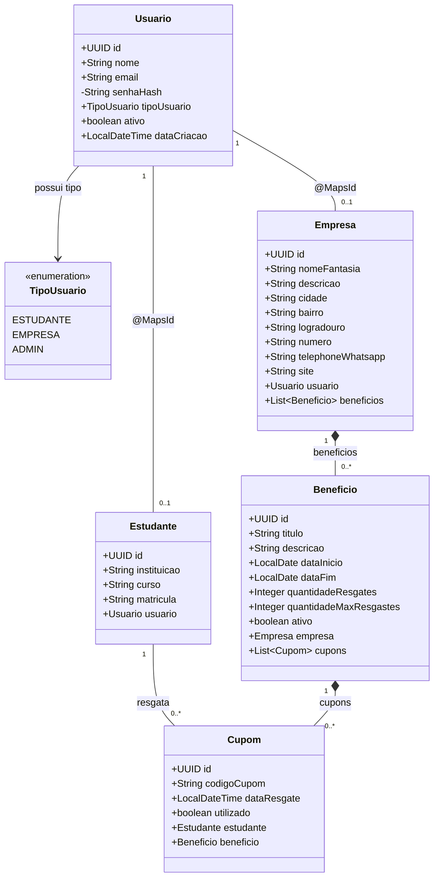

# unioff

## Objetivo do Sistema

O Unioff é uma plataforma de benefícios estudantis que conecta estudantes a estabelecimentos parceiros. O sistema permite que lojas cadastrem e divulguem promoções, descontos e benefícios exclusivos para alunos. Os estudantes podem pesquisar ofertas, visualizar detalhes dos benefícios e realizar resgates por meio da plataforma. O objetivo é facilitar o acesso a vantagens estudantis e aumentar a visibilidade dos estabelecimentos participantes, criando uma relação vantajosa para ambos os lados.


## Integrantes

| Nome | Papel |
|--------|--------|
| Gabriel Ribeiro Irala | Full Stack |
| Leonardo Barreto | Full Stack |
| Marcos Aurélio Santos | Full Stack |
| Marcelo Eugênio Campos | Full Stack |

---

## Tecnologias Utilizadas

### Linguagens

- Java
- JavaScript
  
### Frameworks e Bibliotecas

- Spring Boot
- Spring Security
- Next.js
- React
- Tailwind CSS

### Banco de Dados

- PostgreSQL

### Ferramentas e Agentes de IA

- Antigravity
- Codex

---

## Funcionalidades Previstas

- Cadastro e autenticação de estudantes
- Cadastro e autenticação de estabelecimentos
- Gerenciamento de benefícios e promoções
- Busca e filtragem de ofertas
- Resgate de benefícios
- Painel administrativo para gerenciamento da plataforma


## Arquitetura do Sistema

O sistema utiliza uma arquitetura em camadas, promovendo a separação de responsabilidades e facilitando a manutenção e evolução da aplicação.

### Backend

```text
Controller
    ↓
Service
    ↓
Repository
    ↓
Banco de Dados (PostgreSQL)
```

## Entidades



## Repository

### UsuarioRepository
| Método | Descrição |
|---|---|
| `findByEmail(String email)` | Busca um usuário pelo e-mail. Usado no login (`AuthService.autenticar`) e pelo `JwtAuthenticationFilter` para carregar o usuário autenticado a partir do e-mail extraído do token |
| `existsByEmail(String email)` | Verifica duplicidade de e-mail antes de qualquer cadastro (estudante ou empresa) |

### EstudanteRepository
Sem métodos customizados.

### EmpresaRepository
| Método | Descrição |
|---|---|
| `findByUsuarioEmail(String email)` | Busca a empresa a partir do e-mail do usuário logado, atravessando o relacionamento `Empresa → Usuario`. Usado nas rotas `/api/empresas/me/**` |
| `findByFiltros(nome, cidade, bairro, Pageable)` | Filtros opcionais (só aplicados se não forem `null`) para a listagem pública paginada de empresas (`GET /api/empresas`) |

### BeneficioRepository
| Método | Descrição |
|---|---|
| `findBeneficiosDaEmpresa(email, ativo, esgotado, Pageable)` | Localiza os benefícios de uma empresa pelo e-mail do usuário dono, com filtros opcionais de status (`ativo`) e esgotamento (`quantidadeResgates` vs `quantidadeMaxResgastes`). Usado em `GET /api/empresas/me/beneficios` |

### CupomRepository
| Método | Descrição |
|---|---|
| `findByEstudanteIdOrderByDataGeracaoDesc(UUID estudanteId)` | Histórico de cupons de um estudante, do mais recente para o mais antigo. Usado em `GET /api/resgates/me` |
| `countCuponsPorBeneficioStatus(empresaId, status)` | Conta cupons agrupados por benefício e status (`GROUP BY`), retornando pares `beneficioId`/contagem. Usado no cálculo de métricas da empresa (`GET /api/empresas/me/metricas`) |

### Frontend (a definir)
---

## Histórias de usuários

- COMO ESTUDANTE, QUERO criar uma conta na plataforma,PARA acessar os beneficios oferecidos pelas empresas parceiras.
- COMO EMPRESA, QUERO criar uma conta na plataforma, PARA cadastrar meu estabelecimento e divulgar beneficios.
- COMO EMPRESA, QUERO cadastrar meu estabelecimento, PARA divulgar meus beneficios aos estudantes.
- COMO USUARIO, QUERO realizar login na plataforma.
- COMO ESTUDANTE, QUERO visualizar os detalhes de uma empresa, PARA conhecer os beneficios, a localizacao e as formas de contato.
- COMO EMPRESA, QUERO atualizar minhas informacoes.
- COMO ESTUDANTE, QUERO visualizar os beneficios disponiveis, PARA encontrar descontos do meu interesse.
- COMO ESTUDANTE, QUERO pesquisar beneficios por nome da empresa ou beneficio, PARA encontrar ofertas rapidamente.
- COMO EMPRESA, QUERO cadastrar beneficios, PARA atrair novos estudantes para meu estabelecimento.
- COMO EMPRESA, QUERO editar beneficios.
- COMO EMPRESA,QUERO remover beneficios.
- COMO ESTUDANTE, QUERO resgatar um beneficio, PARA utiliza-lo em um estabelecimento parceiro.
- COMO ESTUDANTE, QUERO visualizar meu historico de resgates, PARA acompanhar os beneficios que ja utilizei.
- COMO EMPRESA, QUERO validar um cupom resgatado, PARA garantir que o beneficio seja utilizado apenas uma vez.
- COMO EMPRESA, QUERO visualizar quantos beneficios foram resgatados, PARA acompanhar o impacto da plataforma no meu negocio.
- COMO ADMINISTRADOR, QUERO desativar empresas ou beneficios que violem as regras, PARA manter a confiabilidade da plataforma.


