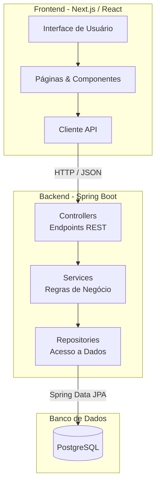
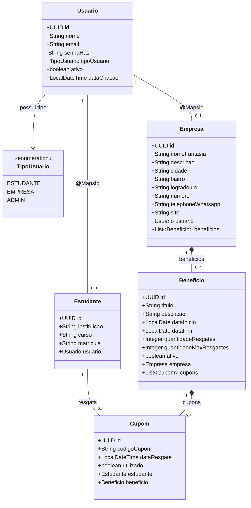
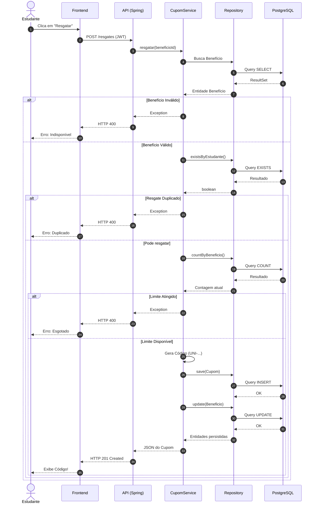

# unioff

## Objetivo do Sistema

O Unioff é uma plataforma de benefícios estudantis que conecta estudantes a estabelecimentos parceiros. O sistema permite que lojas cadastrem e divulguem promoções, descontos e benefícios exclusivos para alunos. Os estudantes podem pesquisar ofertas, visualizar detalhes dos benefícios e realizar resgates por meio da plataforma. O objetivo é facilitar o acesso a vantagens estudantis e aumentar a visibilidade dos estabelecimentos participantes, criando uma relação vantajosa para ambos os lados.

## Integrantes

| Nome | Papel |
|--------|--------|
| Gabriel Ribeiro Irala | Full Stack |
| Leonardo Barreto | Full Stack |
| Marcos Aurélio Santos | Full Stack |
| Marcelo Eugênio Campos | Full Stack |
| Joao Victor Guilherme Teixeira | Frontend |

---

## Tecnologias Utilizadas

### Linguagens

- Java
- JavaScript
  
### Frameworks e Bibliotecas

- Spring Boot
- Spring Security
- Next.js
- React
- Tailwind CSS

### Banco de Dados

- PostgreSQL

### Ferramentas e Agentes de IA

- Antigravity
- Codex

---

## Funcionalidades Previstas

- Cadastro e autenticação de estudantes
- Cadastro e autenticação de estabelecimentos
- Gerenciamento de benefícios e promoções
- Busca e filtragem de ofertas
- Resgate de benefícios
- Painel administrativo para gerenciamento da plataforma

## Arquitetura do Sistema

O sistema utiliza uma arquitetura separada em camadas lógicas e dividida entre o cliente (Frontend) e o servidor (Backend) para garantir escabilidade, manutenção simplificada e clara separação de responsabilidades. A comunicação entre as partes se dá por meio de uma API REST.

```mermaid
flowchart TD
    subgraph Frontend [Frontend - Next.js / React]
        UI[Interface de Usuário] --> Pages[Páginas & Componentes]
        Pages --> API_Client[Cliente API]
    end

    subgraph Backend [Backend - Spring Boot]
        Controller[Controllers\nEndpoints REST] --> Service[Services\nRegras de Negócio]
        Service --> Repository[Repositories\nAcesso a Dados]
    end

    subgraph Banco [Banco de Dados]
        PostgreSQL[(PostgreSQL)]
    end

    API_Client -- "HTTP / JSON" --> Controller
    Repository -- "Spring Data JPA" --> PostgreSQL
```

## Entidades

O diagrama de classes abaixo detalha o modelo de domínio do sistema. Ele ilustra as entidades principais, seus atributos essenciais e os relacionamentos estruturais entre os perfis de usuários (Estudantes e Empresas), os benefícios disponíveis no catálogo e a mecânica de resgate através de cupons.

```mermaid
classDiagram
    direction TB

    class Usuario {
        +UUID id
        +String nome
        +String email
        -String senhaHash
        +TipoUsuario tipoUsuario
        +boolean ativo
        +LocalDateTime dataCriacao
    }

    class TipoUsuario {
        <<enumeration>>
        ESTUDANTE
        EMPRESA
        ADMIN
    }

    class Estudante {
        +UUID id
        +String instituicao
        +String curso
        +String matricula
        +Usuario usuario
    }

    class Empresa {
        +UUID id
        +String nomeFantasia
        +String descricao
        +String cidade
        +String bairro
        +String logradouro
        +String numero
        +String telephoneWhatsapp
        +String site
        +Usuario usuario
        +List~Beneficio~ beneficios
    }

    class Beneficio {
        +UUID id
        +String titulo
        +String descricao
        +LocalDate dataInicio
        +LocalDate dataFim
        +Integer quantidadeResgates
        +Integer quantidadeMaxResgastes
        +boolean ativo
        +Empresa empresa
        +List~Cupom~ cupons
    }

    class Cupom {
        +UUID id
        +String codigoCupom
        +LocalDateTime dataResgate
        +boolean utilizado
        +Estudante estudante
        +Beneficio beneficio
    }

    Usuario --> TipoUsuario : possui tipo
    Usuario "1" -- "0..1" Estudante : @MapsId
    Usuario "1" -- "0..1" Empresa : @MapsId
    Empresa "1" *-- "0..*" Beneficio : beneficios
    Estudante "1" -- "0..*" Cupom : resgata
    Beneficio "1" *-- "0..*" Cupom : cupons
```
---

## Fluxos Principais

O diagrama de sequência abaixo ilustra o fluxo mais crítico e importante do negócio: o **Resgate de Benefício**. Ele detalha a comunicação entre o cliente, a API e o banco de dados, incluindo as regras de validação necessárias antes da geração do cupom.

### Diagrama de Sequência: Resgate de Benefício

```mermaid
%%{init: {'themeVariables': { 'fontSize': '16px', 'fontFamily': 'arial' }}}%%
sequenceDiagram
    autonumber
    actor Estudante
    participant Frontend as Frontend
    participant API as API (Spring)
    participant Service as CupomService
    participant Repo as Repository
    participant DB as PostgreSQL

    Estudante->>Frontend: Clica em "Resgatar"
    Frontend->>API: POST /resgates (JWT)
    
    API->>Service: resgatar(beneficioId)
    
    Service->>Repo: Busca Benefício
    Repo->>DB: Query SELECT
    DB-->>Repo: ResultSet
    Repo-->>Service: Entidade Benefício
    
    alt Benefício Inválido
        Service-->>API: Exception
        API-->>Frontend: HTTP 400
        Frontend-->>Estudante: Erro: Indisponível
    else Benefício Válido
        Service->>Repo: existsByEstudante()
        Repo->>DB: Query EXISTS
        DB-->>Repo: Resultado
        Repo-->>Service: boolean
        
        alt Resgate Duplicado
            Service-->>API: Exception
            API-->>Frontend: HTTP 400
            Frontend-->>Estudante: Erro: Duplicado
        else Pode resgatar
            Service->>Repo: countByBeneficio()
            Repo->>DB: Query COUNT
            DB-->>Repo: Resultado
            Repo-->>Service: Contagem atual
            
            alt Limite Atingido
                Service-->>API: Exception
                API-->>Frontend: HTTP 400
                Frontend-->>Estudante: Erro: Esgotado
            else Limite Disponível
                Service->>Service: Gera Código (UNI-...)
                
                Service->>Repo: save(Cupom)
                Repo->>DB: Query INSERT
                DB-->>Repo: OK
                
                Service->>Repo: update(Beneficio)
                Repo->>DB: Query UPDATE
                DB-->>Repo: OK
                
                Repo-->>Service: Entidades persistidas
                
                Service-->>API: JSON do Cupom
                API-->>Frontend: HTTP 201 Created
                Frontend-->>Estudante: Exibe Código!
            end
        end
    end
```

---

## Histórias de usuários

- COMO ESTUDANTE, QUERO criar uma conta na plataforma,PARA acessar os beneficios oferecidos pelas empresas parceiras.
- COMO EMPRESA, QUERO criar uma conta na plataforma, PARA cadastrar meu estabelecimento e divulgar beneficios.
- COMO EMPRESA, QUERO cadastrar meu estabelecimento, PARA divulgar meus beneficios aos estudantes.
- COMO USUARIO, QUERO realizar login na plataforma.
- COMO ESTUDANTE, QUERO visualizar os detalhes de uma empresa, PARA conhecer os beneficios, a localizacao e as formas de contato.
- COMO EMPRESA, QUERO atualizar minhas informacoes.
- COMO ESTUDANTE, QUERO visualizar os beneficios disponiveis, PARA encontrar descontos do meu interesse.
- COMO ESTUDANTE, QUERO pesquisar beneficios por nome da empresa ou beneficio, PARA encontrar ofertas rapidamente.
- COMO EMPRESA, QUERO cadastrar beneficios, PARA atrair novos estudantes para meu estabelecimento.
- COMO EMPRESA, QUERO editar beneficios.
- COMO EMPRESA,QUERO remover beneficios.
- COMO ESTUDANTE, QUERO resgatar um beneficio, PARA utiliza-lo em um estabelecimento parceiro.
- COMO ESTUDANTE, QUERO visualizar meu historico de resgates, PARA acompanhar os beneficios que ja utilizei.
- COMO EMPRESA, QUERO validar um cupom resgatado, PARA garantir que o beneficio seja utilizado apenas uma vez.
- COMO EMPRESA, QUERO visualizar quantos beneficios foram resgatados, PARA acompanhar o impacto da plataforma no meu negocio.
- COMO ADMINISTRADOR, QUERO desativar empresas ou beneficios que violem as regras, PARA manter a confiabilidade da plataforma.
